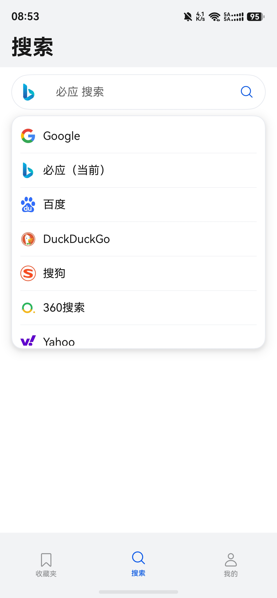
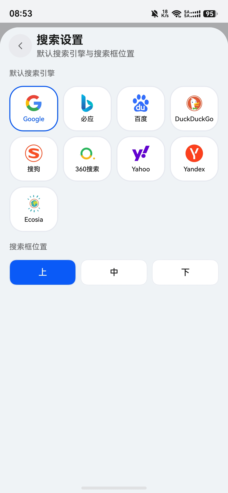

# 网址收藏夹

面向 **HarmonyOS（鸿蒙）** 的轻量书签应用：把电脑浏览器里导出的收藏夹带到手机上，**点一下即打开链接**，无需臃肿套件。

## 核心亮点

- **Edge / Chrome 通用导入**  
  支持 **Microsoft Edge** 与 **Google Chrome** 导出的 **HTML 书签文件**（两者均采用经典的 Netscape 书签格式，本应用按该格式解析）。在 PC 上导出收藏夹后，将 `.html` 文件导入本应用即可在鸿蒙设备上浏览相同目录结构。
- **一触即达**  
  收藏夹 Tab 中点击条目即可通过系统浏览器打开对应网址，常用站点随手可达。
- **轻量专注**  
  以书签管理与快捷打开为主，界面与依赖保持精简，适合作为「随身网址面板」使用。

## 功能展示

- **收藏夹**：按文件夹整理导入后的书签；右上角菜单 **导入收藏** 可选择 Edge / Chrome 导出的 HTML 文件。  
- **搜索**：多引擎搜索页；搜索框可 **临时切换** 引擎；**我的 → 搜索设置** 可设默认引擎与搜索框位置（上 / 中 / 下）。  
- **背景**：**我的 → 设置背景** 支持相册或文件（JPG / PNG / WebP / GIF）、虚化与明暗度，并可恢复默认。

**收藏夹 · 搜索主页**（一行三张）

| 收藏夹列表 | 导入收藏 | 搜索主页 |
| :--------: | :------: | :------: |
|  |  |  |

| 临时切换搜索引擎 | 搜索设置 | 设置背景 |
| :--------------: | :------: | :------: |
|  |  |  |

## 在 Edge / Chrome 中导出收藏夹（HTML）

1. **Edge**：在 **设置** 或 **收藏夹 / 收藏夹管理** 相关页面中，选择将收藏夹 **导出为 HTML 文件**（不同版本菜单位置可能略有差异）。  
2. **Chrome**：打开 **书签管理器**（菜单或地址栏输入 `chrome://bookmarks`），通过菜单将书签 **导出为 HTML 文件**。

> 若其他 Chromium 系浏览器同样导出为上述 HTML 格式，一般也可导入使用。

## 安装方式

1. 在 **[Releases](https://github.com/jonas-pi/webfolder/releases)** 下载最新 **`entry-default-unsigned.hap`**（本仓库提供的是**未签名**调试包，便于自行安装体验）。  
   - 固定直链（始终指向最新一次 Release 中的同名附件）：  
     [https://github.com/jonas-pi/webfolder/releases/latest/download/entry-default-unsigned.hap](https://github.com/jonas-pi/webfolder/releases/latest/download/entry-default-unsigned.hap)

2. 将 HAP 安装到 **HarmonyOS NEXT** 等设备上，推荐使用 **小白调试助手**（开源 HAP 安装工具，原项目名 Auto-Installer）：  
   **[https://github.com/likuai2010/auto-installer](https://github.com/likuai2010/auto-installer)**  
   按该仓库说明在 Windows / macOS / Linux 等环境连接设备后安装即可（具体步骤以工具文档为准）。

## 开发说明

- **工程类型**：HarmonyOS 应用（ArkTS / ArkUI）。
- **包名**：`com.jonas.webbookmarks`（见 `AppScope/app.json5`）。
- **构建**：使用 DevEco Studio 打开本目录，按官方流程编译与签名安装。

## 权限说明

- **网络**：用于站点图标等可选网络能力（以工程 `module.json5` 为准）。
- **振动**：用于轻量触感反馈（可在系统设置中管理）。

---

在鸿蒙上延续你在 Edge / Chrome 里的收藏习惯，**导入一次，随身一点即开**。
